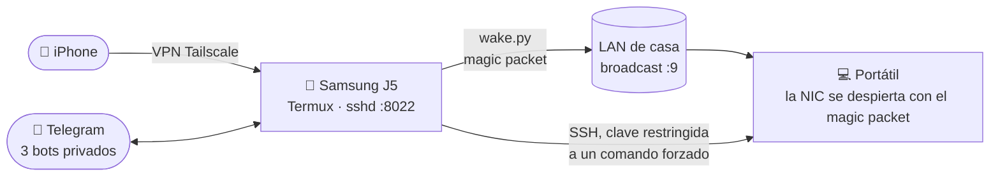
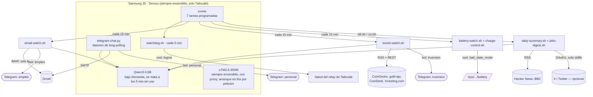

<div align="center">

# AXP.OS Bridge

### Un móvil Android sin Google como puente permanente de Wake-on-LAN, asistente con IA local, y vigilante de correo/mercados

Samsung Galaxy J5 viejo → ROM sin Google a medida → rooteado, reducido a 4 apps → enciende y apaga un portátil por Tailscale, lee/responde/redacta correos en lenguaje natural, vigila RSS/mercados/ofertas de empleo, y avisa de todo por 3 bots privados de Telegram — todo corriendo en el propio dispositivo, con un LLM local de 0.6B haciendo el trabajo de lenguaje.

🌍 **Idioma:** [English](README.md) · Español


[](LICENSE)

</div>

---

## Por qué existe esto

Un portátil apagado ahorra energía pero no se puede alcanzar en remoto. Wake-on-LAN resuelve eso — salvo que el magic packet tiene que originarse *dentro* de la red de casa, así que igualmente hace falta algo en casa, encendido 24/7, para mandarlo cuando se le pida. Comprar un enchufe inteligente o una Raspberry Pi es la respuesta habitual. La respuesta de este proyecto fue: un móvil Android viejo que ya estaba en un cajón, con una ROM sin Google para que no llame a casa, enchufado permanentemente y conectado por [Tailscale](https://tailscale.com/).

Una vez que un móvil está ahí 24/7 de todas formas, resulta que es una caja Linux de bajo consumo bastante decente: puede correr un LLM local, vigilar una bandeja de entrada, consultar feeds RSS, y contestar por Telegram — todo sin ningún puerto expuesto a internet, sin factura en la nube, y sin una sola API key que no sea autoalojada.

## Qué hace

| Función | Cómo |
|---|---|
| 🖥️ **Encender un portátil desde cualquier sitio** | iPhone → Tailscale → SSH al J5 → magic packet de Wake-on-LAN en la LAN de casa |
| ⏻ **Apagarlo desde cualquier sitio** | Mensaje de Telegram → confirmación en dos pasos → SSH con una clave restringida a *un único* comando forzado (`sudo poweroff`), nada más |
| 🤖 **LLM local, en el propio dispositivo** | `llama.cpp` compilado desde código en Termux, dos modelos: uno siempre rápido y otro bajo demanda para lo que necesite razonar de verdad |
| 📬 **Lee, clasifica, redacta y manda correos** | Un vigilante IMAP clasifica el correo entrante (importante / rutina / oferta de empleo), redacta respuestas y correos nuevos — en lenguaje natural o con un formato fijo — siempre detrás de un paso de revisión y confirmación antes de que SMTP mande nada de verdad |
| 💬 **Tres bots privados de Telegram** | Personal (noticias tech/IA, correo importante, preguntas sobre el dispositivo), Inversión (movimientos de BTC/oro, noticias macro), Empleo (ofertas filtradas, traducidas) |
| 📈 **Vigilante de mercados y noticias** | Detección de movimientos anómalos de BTC/oro, avisos urgentes por palabra clave, resúmenes agrupados en vez de un mensaje por titular |
| 🔋 **Carga consciente de la salud de la batería** | Corta la corriente de carga de verdad, en un umbral elegido con investigación real sobre envejecimiento por calendario, no por intuición — ver [Estrategia de batería](#-estrategia-de-batería-investigada-no-adivinada) |
| 🩺 **Watchdog autorreparador** | Cada 5 minutos: ¿está `sshd` vivo?, ¿está el túnel de Tailscale arriba?, ¿está el WiFi realmente asociado (no solo la VPN)?, ¿está vivo el bot de chat?, ¿está a punto de matar algo el sistema por falta de RAM? |
| 🔐 **Root, usado con alcance mínimo** | Dos concesiones de Magisk independientes (una identidad efímera de depuración USB, y el propio Termux), cada una usada para exactamente lo único que hace falta — nunca como un "correr como root" genérico |

## Arquitectura





## Parte 1 — Flashear el móvil (desde cero)

Esta es la parte que la mayoría de guías se saltan. En concreto, para un Samsung Galaxy J5 (2017), **SM-J530F**, codename `j5y17ltexx`:

1. **Elegir una ROM sin Google.** Este proyecto usa **[AXP.OS](https://axpos.org/)** (una build derivada de [DivestOS](https://divestos.org/)/LineageOS) que trae [microG](https://microg.org/) en vez de los Google Play Services reales — `com.google.android.gms`/`gsf` en este dispositivo son los stubs de compatibilidad de microG, no los binarios reales de Google. Página del dispositivo y descargas para este modelo exacto: **[axpos.org/devices/samsung/j5y17lte](https://axpos.org/devices/samsung/j5y17lte/)** (zip de la ROM + recovery en [download.axpos.org/axp/j5y17lte/](https://download.axpos.org/axp/j5y17lte/), clave pública de firma [en GitHub](https://github.com/sfX-android/update_verifier/raw/refs/heads/main/AXP.OS/j5y17lte_AXP.OS_pubkey), más un mirror Tor/`.onion` listado en la misma página para cuando el host normal esté caído).

   > [!WARNING]
   > **AXP.OS no trae firmware propio** — lo documenta explícitamente como un paso manual y remite a mirrors de firmware de Samsung de terceros (**sfirmware.com**, **samfrew.com**, ver la [guía de firmware de axpos.org](https://axpos.org/docs/guides/firmware/samsung/)), que esa misma guía etiqueta como *"sin verificar y sin probar"*. **Aquí es donde falló una descarga durante el montaje de este proyecto** — uno de esos mirrors de firmware de terceros no llegaba a completarse. Si te pasa lo mismo: busca en [archive.org](https://archive.org/) el nombre exacto del fichero de firmware que necesita tu dispositivo (para este modelo, nombres tipo `HEIMDALL_SM-J530F_<CSC/build>_firmware.gz` son habituales) antes de rendirte con un mirror — <!-- TODO(usuario): pega aqui la URL exacta de archive.org que funciono, para que quien lea esto despues no tenga que repetir la busqueda --> el enlace real de Internet Archive que sí funcionó va aquí en cuanto se confirme.
2. **Flashearlo.** La propia guía de instalación de AXP.OS recomienda explícitamente **[Heimdall](https://gitlab.com/BenjaminDobell/Heimdall)** (`heimdall flash --RECOVERY recovery.img`, ver la [guía de instalación non-A/B de axpos.org](https://axpos.org/Installation-on-Non-A-B-devices)) en vez de TWRP para esta familia de dispositivos, y avisa de que la Anti-Rollback Protection de Samsung puede dejar el dispositivo en brick si se flashea mal — lee esa guía entera antes de empezar, no improvises el comando.
3. **Rootear con [Magisk](https://github.com/topjohnwu/Magisk)** (este proyecto usa la 30.7) parcheando la imagen de boot y flasheando la imagen parcheada en vez de la de fábrica. El root queda *instalado* en este paso pero todavía no concedido a nada — cualquier app que quiera `su` tiene que pedirlo, una por una, más adelante (ver [Root, usado con alcance mínimo](#-root-usado-con-alcance-mínimo-no-como-atajo)).

## Parte 2 — Reducirlo a 4 apps

Todo lo que no es imprescindible se desactiva con `pm disable-user --user 0 <paquete>` (reversible con `pm enable`) — interfaz de telefonía/SMS (no hay SIM en este dispositivo), Bluetooth/NFC, las apps de cámara/galería/calendario/calculadora, la infraestructura de backup, la Aurora Store, la propia interfaz de ajustes de microG/GSF, el launcher duplicado de fábrica, y el asistente de configuración inicial. **46 paquetes** desactivados en total en esta build.

**Se conservan, deliberadamente:**

| App | Paquete | Por qué |
|---|---|---|
| [Termux](https://github.com/termux/termux-app) | `com.termux` | El runtime de verdad — cron, Python, `llama.cpp`, sshd |
| [Termux:Boot](https://github.com/termux/termux-boot) | `com.termux.boot` | Arranca todo tras un reinicio sin intervención manual |
| [Termux:API](https://github.com/termux/termux-api) | `com.termux.api` | Estado de batería, info de WiFi, planificador de tareas — las rutas de sysfs/dumpsys a las que una app normal no llega |
| [Tailscale](https://tailscale.com/) | `com.tailscale.ipn` | La única vía de red de entrada o salida; configurado como VPN siempre activa, sin lockdown |
| [F-Droid](https://f-droid.org/) | `org.fdroid.fdroid` | La única tienda de apps que queda |
| [Olauncher](https://github.com/tanujnotes/Olauncher) | `app.olauncher` | Launcher de texto mínimo — sin iconos, sin widgets, nada que renderizar |

**Nunca se toca** (núcleo del sistema / riesgo de boot): `android`, SystemUI, Ajustes, los content providers de settings/downloads/media, el networkstack, `com.android.phone` (se conserva pese a no haber SIM — demasiado integrado como para arriesgarse), el proveedor de WebView del sistema, `lineageos.platform`, y ~40 overlays de tema/RRO sin proceso propio.

**Una trampa real, si algún día tocas los ajustes de fondo de pantalla:** `com.android.wallpaper`/`com.android.wallpapercropper` están desactivados por defecto en esta build. Con ellos desactivados, cualquier intent de "establecer fondo de pantalla" resuelve mal (llegó a abrir la app de Contactos). Reactívalos primero.

### Termux desde GitHub, no desde F-Droid

F-Droid firma cada paquete con su propia clave, y la relación de UID compartido entre Termux y Termux:Boot necesita firmas coincidentes. Las tres builds de Termux:Boot de F-Droid probadas aquí fallaron con `INSTALL_FAILED_SHARED_USER_INCOMPATIBLE` contra un Termux de F-Droid — no hay ninguna combinación que funcione ya. La solución es usar los [releases oficiales de GitHub](https://github.com/termux/termux-app/releases) para **ambos**, Termux y Termux:Boot (y más adelante Termux:API), nunca mezclados con builds de F-Droid. Reflashear Termux cambia su UID de Android, lo cual importa si algo (una config SSH, un script) tiene el UID viejo escrito a mano.

## Parte 3 — Que sobreviva a un reinicio

Conseguir que `sshd` vuelva tras un `reboot` de verdad (no un reinicio en caliente) necesitó tres cosas nada obvias, que no están documentadas juntas en ningún sitio:

1. **Termux:Boot hay que abrirlo una vez a mano**, antes de que reciba nunca `BOOT_COMPLETED` — Android no entrega ese broadcast a una app que nunca se ha lanzado.
2. **Exención de optimización de batería** para Termux y Termux:Boot (`dumpsys deviceidle whitelist`).
3. **Sin bloqueo de pantalla / PIN.** Con uno puesto, el cifrado por fichero de Android no se desbloquea hasta que alguien teclea el PIN a mano tras el arranque — y `BOOT_COMPLETED` no llega nunca a Termux:Boot (no es direct-boot-aware) hasta que eso pasa. Sin PIN, todo arranca solo.

Tailscale también necesita un flag explícito de **VPN siempre activa** — una app de VPN no se reinicia sola tras un reboot solo por no estar "force-stopped":

```sh
settings put secure always_on_vpn_app com.tailscale.ipn
settings put secure always_on_vpn_lockdown 0
```

Todo esto se verificó contra reinicios *reales* (`adb reboot` + sondeo de `sys.boot_completed`), no reinicios en caliente — sshd escuchando, WiFi y Tailscale arriba, todo sin tocar el móvil.

## Parte 4 — El puente de Wake-on-LAN en sí

```
iPhone → Tailscale → ssh -p 8022 al J5 → ~/wake.py → broadcast UDP → :9 → la NIC del portátil despierta
```

[`wake.py`](scripts/wake.py) son once líneas de `socket` de la stdlib — ninguna dependencia se gana el sitio para un magic packet. La NIC del portátil necesita Wake-on-LAN activado en firmware/SO para que esto haga algo.

**Hablarle por Telegram en vez de por SSH:** [`telegram-chat.py`](scripts/telegram-chat.py) reconoce un conjunto pequeño y fijo de frases disparadoras (`/wake`, `despertar`, `enciende el pc`, por regex, incluidas conjugaciones irregulares del español) *antes* de que nada llegue al LLM — el modelo nunca decide si se manda un magic packet, solo lo decide una coincidencia de texto literal. Apagar sigue la misma idea con una capa más, descrita a continuación.

## Parte 5 — Apagar el portátil (esta sí tiene dientes de verdad)

Encender una máquina es inofensivo — en el peor caso se enciende cuando nadie lo necesitaba. Apagarla en remoto no lo es: puede tirar trabajo sin guardar. Tres capas, cada una imprescindible por sí sola:

1. **Un par de claves SSH dedicado**, generado en el móvil, la privada nunca sale de ahí. La línea correspondiente en el `authorized_keys` del portátil lleva `command="sudo /usr/sbin/poweroff",no-pty,no-agent-forwarding,no-X11-forwarding,no-port-forwarding` — esa clave solo puede ejecutar *exactamente un comando*, sin shell, da igual lo que pida el cliente. Una clave robada da un portátil que se apaga, no una shell.
2. **Una regla de sudoers acotada** (`/etc/sudoers.d/`): `NOPASSWD` para esa ruta de binario exacta, no `sudo` en general.
3. **Confirmación en dos pasos por chat**: la frase disparadora (`apaga el pc`, `/apagar`, conjugaciones en imperativo *y* subjuntivo del español) solo encola una petición; el portátil solo se apaga si llega la palabra literal `CONFIRMAR` en los siguientes 60 segundos.

El mecanismo de comando forzado se validó de punta a punta con un placeholder inofensivo (`command="/usr/bin/true"`) *antes* de apuntarlo nunca a un `poweroff` real — la autenticación SSH real, el flujo de confirmación, y el camino de fallback se probaron todos sin ningún riesgo de cortar la corriente de verdad a mitad de una prueba.

## Parte 6 — LLM local, de dos formas

`llama.cpp` tuvo que compilarse desde código en Termux (~40 minutos en esta CPU) — el instalador oficial solo trae binarios precompilados para plataformas de escritorio, no para Android/Termux.

| Modelo | Puerto | Corre | Por qué |
|---|---|---|---|
| **LFM2.5-350M** | 8080 (público) | Bajo demanda, con proxy — un `http.server` ligero de la stdlib escucha 24/7 y solo arranca en frío `llama-server` en la primera petición real, matándolo tras 5 minutos sin uso | Rápido (10 tok/s), usado para acceso directo ocasional a la API desde fuera de casa — pero no sigue bien instrucciones compuestas ni traduce de forma fiable, así que nada automático lo llama |
| **Qwen3-0.6B** | 8082 (interno) | Bajo demanda, arrancado/parado por cada llamada desde `lib.sh` | Lo que usa de verdad cada script automático — necesita el sufijo literal `/no_think` o gasta todo su presupuesto de tokens "pensando" en vez de responder (el modo de razonamiento de Qwen3 viene activado por defecto) |

Comparados cara a cara en este hardware (Cortex-A53, ~1.8GB de RAM utilizable): LFM2.5 es aproximadamente 2× más rápido y usa la mitad de RAM, pero Qwen3 sí sigue instrucciones — de ahí el reparto.

El proxy siempre encendido existe porque la versión ingenua (`llama-server` corriendo 24/7) quemaba CPU/calor todo el día para un modelo al que nada automático llamaba — el móvil está enchufado, así que el coste no era batería, era térmico.

## Parte 7 — Leer, redactar y responder correos en lenguaje natural

[`imap_watch.py`](scripts/imap_watch.py) consulta Gmail en modo solo lectura (`BODY.PEEK`, nada se marca como leído), clasifica cada mensaje nuevo, y lo enruta. Nada de la clasificación es una sola llamada al LLM haciéndolo todo — un modelo de 0.6B no es lo bastante fiable para eso, confirmado probándolo:

- **Alertas de empleo de LinkedIn / Monster**: parseadas como texto/HTML estructurado (`html.parser`, stdlib), filtradas por palabra clave + seniority + ubicación, agrupadas en un resumen en vez de avisar una por una.
- **Confirmaciones de "hemos recibido tu candidatura"**: detectadas y descartadas por un filtro de palabras clave determinista *antes* de que el LLM las vea siquiera — no son ofertas nuevas y no requieren acción.
- **Correos de reclutadores/RRHH fuera de LinkedIn/Monster**: también un filtro de palabras clave (`recruit|candidate experience|talent acquisition|...`), porque un prompt de 2 vías IMPORTANTE/RUTINA fallaba con estos (la palabra "entrevista" por sí sola hacía que el modelo marcara todo como urgente) — añadir una clasificación de 3 vías lo empeoró, no lo mejoró, así que se volvió a que las palabras clave decidan primero, el LLM solo para lo que queda.
- **Todo lo demás**: una llamada real de 2 vías IMPORTANTE/RUTINA a Qwen, solo después de que los filtros deterministas de arriba hayan tenido su oportunidad de interceptarlo.

**Redactar y responder** pasan por el mismo patrón de seguridad que apagar — nada se manda sin que un humano confirme:

- `/enviar` con un formato fijo `Para:`/`Asunto:`/cuerpo — el LLM no interviene nunca en *qué* se manda.
- Lenguaje natural (`"manda un correo a x@y.com diciendo que…"`) — el destinatario se extrae con una regex que exige una dirección de correo literal presente en el mensaje (nunca inferida por el modelo); solo el *cuerpo* lo redacta Qwen, para ese destinatario ya fijado.
- Responder a un mensaje que el bot ya reenvió (función nativa "Responder" de Telegram) — el remitente original y el `Message-ID` se capturaron cuando se mandó el aviso, así que una respuesta real lleva cabeceras `In-Reply-To`/`References`, no solo un correo nuevo sin relación a la misma dirección.
- Todos los caminos acaban en el mismo borrador: se enseña tal cual, y solo se manda con `CONFIRMAR` — **o**, reenviando el mismo bloque `Para:`/`Asunto:`/cuerpo *editado* se manda la versión nueva de inmediato, sin una segunda vuelta de confirmación. Ese comportamiento concreto existe porque los borradores del modelo de 0.6B son usables pero a menudo necesitan una línea corregida antes de merecer la pena mandarlos — ver [Limitaciones conocidas](#-limitaciones-conocidas).

## Parte 8 — Estrategia de batería (investigada, no adivinada)

La regla ingenua de "mantenla entre 20-80%" está pensada para un móvil que se desenchufa y se usa todo el día — optimiza la *profundidad de ciclo*. Un móvil que está permanentemente enchufado y casi siempre inactivo se enfrenta a un fallo completamente distinto: el **envejecimiento por calendario** — degradación por estar mucho tiempo a un nivel de carga alto, independientemente de los ciclos. [Battery University, BU-808](https://www.batteryuniversity.com/article/bu-808-how-to-prolong-lithium-based-batteries/) le pone un número aproximado: tras un año a 25°C, una celda guardada al 40% conserva ~96% de su capacidad; al 100%, ~80%.

Eso replantea la pregunta real: no "cuán ancho debe ser el rango", sino "cuánto se puede bajar el techo". [`charge-control.sh`](scripts/charge-control.sh) corta la corriente de carga físicamente al **60%** y la reanuda al **45%** — más estrecho y más bajo que el 75-80% inicial con el que empezó este proyecto — usando el único nodo de sysfs en este hardware (`batt_slate_mode`, del driver `sec_battery` de Samsung) que de verdad para la carga (`charge_control_limit` es un stub que no hace nada; `store_mode` se queda permanentemente pegado y se descartó por completo).

Una segunda ronda de investigación, aparte, comprobó si ciclar *más a menudo* en esa banda más estrecha hace algún daño — no lo hace. El "efecto memoria" que hace sentir arriesgado cargar en trozos pequeños con frecuencia es un mito de la era NiCd/NiMH que no aplica al ion-litio; la relación entre profundidad de descarga y vida en ciclos es fuertemente no lineal, así que muchos ciclos *superficiales* son desproporcionadamente más suaves que el mismo total acumulado en menos ciclos *profundos*. Lo que de verdad daña una celda de ion-litio es quedarse en los extremos — casi vacía o completamente llena — no la frecuencia con la que carga.

**Un incidente de seguridad real al ajustar esto:** la primera vez que se cortó y reanudó la carga, reanudarla no restauró la carga sola — `status` se quedó en `DISCHARGING` con el cargador puesto, y solo un `reboot` completo lo arregló. Por eso la versión desplegada reintenta la reanudación verificada hasta 3 veces y **reinicia el dispositivo automáticamente** como último recurso (con un cooldown de 1 hora para que un fallo persistente no entre en bucle de reinicios) en vez de asumir que la escritura funcionó. `battery-watch.sh` también reutiliza su antigua comprobación de "atascado al 100%" como detector de anomalía: si el móvil se ve alguna vez cerca del 100%, es que `charge-control.sh` ya ha fallado en silencio, sea cual sea el umbral configurado.

## Parte 9 — Root, usado con alcance mínimo (no como atajo)

Hay dos concesiones de Magisk *separadas* en este dispositivo, y se mantuvieron separadas a propósito:

- **La identidad de depuración USB ("shell")** — concedida una vez, usada para investigación manual vía `adb shell su -c ...` (inventariar cada nodo de `/sys/class/power_supply/battery/`, probar cuál para la carga de verdad, forzar la reconexión de Tailscale vía `am start-foreground-service` en vez de abrir su interfaz).
- **La identidad del propio Termux (`u0_a120`)** — necesaria para lo que corre sin supervisión desde cron: `charge-control.sh` escribiendo en `batt_slate_mode`, y `watchdog.sh` leyendo el propio `logcat` de la app de Tailscale para pillar un aviso transitorio de "relay no disponible" que no deja ningún otro rastro visible (no hay CLI `tailscale` en la build de Android, ni socket de LocalAPI expuesto).

Conceder la segunda no fue tan simple como tocar "Permitir" — un cron ya había disparado el diálogo de Magisk una vez sin nadie delante, y quedó denegado en silencio por timeout. Magisk no vuelve a preguntar una vez que hay una decisión guardada; el arreglo fue voltear Denegar → Conceder a mano en la propia app de Magisk, no volver a ejecutar el script esperando un diálogo nuevo. Verificado después: el siguiente tick del watchdog fue directo al camino de reconexión seguro, sin denegación y sin abrir ninguna pantalla.

Lo que el root **no** se convirtió, una vez disponible: una forma de darle al LLM un `sudo` amplio. Cada acción con root sigue pasando por una ruta de script fija o un comando SSH forzado — nunca por un modelo decidiendo qué comando ejecutar.

## 🩺 Limitaciones conocidas

- **El modelo local de 0.6B es limitado de verdad.** Confirmado directamente: al preguntarle por su propia batería sin inyectarle datos reales, alucinó sobre "un vehículo llamado Ride". Arreglado inyectando datos reales de `termux-battery-status`/uptime/estado de Tailscale en cada prompt que pudiera necesitarlos — pero el texto de correos/tweets que redacta este modelo sigue necesitando un vistazo humano antes de confirmar, siempre.
- **La calidad de traducción es floja.** Los fragmentos de ofertas de empleo se traducen al español antes de reenviarse; hay que esperar cosas como "Test Template" → "Preguntas de prueba" (debería ser "Plantilla de prueba"). No merece la pena perseguir más precisión con este tamaño de modelo.
- **`adb shell input text/keyevent` es peligroso de verdad cerca de la interfaz de Tailscale.** Un `keyevent 66` (Enter) suelto, mandado sin capturar pantalla antes, aterrizó sobre el interruptor de conexión de Tailscale y desactivó la VPN — más de una vez, durante sesiones de depuración, casi siempre en un límite de tick de cron `:00/:05` una vez que se rastreó la *causa*. Regla adoptada después: nunca encadenar llamadas a `input` sin una captura de pantalla entre medias, y evitar pilotar el dispositivo por USB en los minutos redondos de 5.
- **`ip` no está en el `$PATH` de Termux** (solo en `/system/bin`, que Termux no incluye) — `ip addr show tun0` devuelve silenciosamente nada útil. Mejor leer `/proc/net/dev` directamente.
- **`termux-job-scheduler --network none` no significa "sin red".** Significa *sin ninguna restricción de red* — un job con ese filtro se dispara casi al instante en cuanto hay algo pendiente. Un diseño de dos jobs pensado para hacer ping-pong según el estado de conectividad se convirtió en un bucle sin restricción, ~1000 iteraciones en menos de 2 minutos, hasta que los scripts fuente se sobreescribieron con un no-op para cortar la cadena. `--network any` sí es una restricción real (espera a que haya conectividad de verdad) para un job de un solo disparo genuino — solo hay que asegurarse de que ese job nunca se reprograma a sí mismo.
- **Escribir dentro de `/data/data/com.termux/` desde fuera de la app — incluso como root — falla.** Las categorías MLS de SELinux por app lo bloquean sea cual sea el permiso Unix. El único camino que funciona: subir a `/sdcard/Download/`, poner Termux en primer plano, y ejecutar la copia desde *dentro* de su propia sesión.

## Puesta en marcha

Esto no es un instalador de un comando — es un montaje totalmente manual, documentado para que sea reproducible, no automatizado:

```sh
# 1. Consigue Termux + Termux:Boot + Termux:API de los releases oficiales de GitHub
#    (no de F-Droid — ver Parte 2)

# 2. Dentro de Termux
pkg install python git openssh cronie jq termux-api
git clone <url-de-este-repo>
cd axp-os

# 3. Credenciales — nunca las subas, ya estan en el .gitignore
echo "tu-app-password-de-gmail" > ~/.imap_pass
cp scripts/lib.sh ~/scripts/lib.sh   # y rellena los placeholders de dentro

# 4. Autoarranque (Termux:Boot ejecuta lo que haya en ~/.termux/boot/)
mkdir -p ~/.termux/boot
cp boot/* ~/.termux/boot/

# 5. Cron (crontab -e), ver la tabla de horarios mas abajo

# 6. Compilar llama.cpp desde codigo (~40 min en una CPU de gama movil)
git clone https://github.com/ggml-org/llama.cpp && cd llama.cpp && cmake -B build && cmake --build build -j4
```

### Horario de cron

| Horario | Script | Hace |
|---|---|---|
| `*/5 * * * *` | `watchdog.sh` | Vida de sshd/Tailscale/WiFi/bot de chat, diagnostico de OOM, reafirma el limite de CPU |
| `*/15 * * * *` | `email-watch.sh` | Clasifica y enruta correo nuevo |
| `*/15 * * * *` | `invest-watch.sh` | Vigila precio de BTC/oro + noticias |
| `*/15 * * * *` | `battery-watch.sh` | Avisos de temperatura + anomalia de carga atascada |
| `*/15 * * * *` | `charge-control.sh` | Corta/reanuda la carga al 60%/45% |
| `0 8,14 * * *` | `daily-summary.sh` | Resumen de Tech/IA/geopolitica (+ hilo de Twitter opcional) |
| `0 8,14 * * *` | `jobs-digest.sh` | Resumen agrupado de ofertas de empleo |

### Variables de entorno / credenciales (rellena las tuyas — nunca subas valores reales)

| Fichero | Contenido | Lo usa |
|---|---|---|
| `scripts/lib.sh` | `BOT_TOKEN_PERSONAL`, `BOT_TOKEN_INVEST`, `BOT_TOKEN_JOBS`, `CHAT_ID`, `API_KEY` del LLM local | Todos los scripts (`send_telegram`, `explain`) |
| `~/.imap_pass` | App Password de Gmail | `imap_watch.py`, envio SMTP en `telegram-chat.py` |
| `~/.twitter_creds` | API key/secret + access token/secret de X (OAuth1, 4 lineas) — opcional | `twitter.py` |
| `scripts/telegram-chat.py` | `LAPTOP_IP` (IP de Tailscale), `LAPTOP_USER`, `EMAIL_USER` | Encender/apagar, SMTP |
| `scripts/wake.py` | MAC de la tarjeta de red objetivo, IP de broadcast de la LAN | Magic packet |

## Estructura del proyecto

```text
axp-os/
├── scripts/          # Todo lo que corre en el movil via cron o Telegram
│   ├── lib.sh                  # Compartido: envio+log a Telegram, llamadas al LLM local
│   ├── watchdog.sh              # Bucle de vida cada 5 min + OOM + limite de CPU
│   ├── charge-control.sh        # Maquina de estados del corte de bateria
│   ├── battery-watch.sh         # Avisos de temperatura/anomalia
│   ├── cpu-limit.sh              # Techo de scaling_max_freq (idempotente)
│   ├── imap_watch.py / email-watch.sh    # Clasificacion y enrutado de correo
│   ├── invest-watch.sh          # Vigilante de mercados/noticias
│   ├── daily-summary.sh         # Resumen Tech/IA/geo (+ hilo de Twitter)
│   ├── jobs-digest.sh / parse_jobs.py / job_filters.py   # Pipeline de ofertas de empleo
│   ├── telegram-chat.py         # El bot bidireccional: encender/apagar/correo/tweet
│   ├── twitter.py               # Firma OAuth1 hecha a mano, solo stdlib
│   ├── llm-proxy.py             # Proxy con arranque en frio para el modelo siempre encendido
│   ├── wake.py                  # El magic packet en si
│   └── check_move.py / parse_feed.py     # Ayudantes compartidos pequeños
├── boot/             # Se copian a ~/.termux/boot/ — un script por servicio
├── LICENSE
└── README.md / README.es.md
```

## Hoja de ruta / sin terminar

- **Publicar en Twitter/X** — código completo (firma OAuth1 validada contra el ejemplo oficial documentado por X), sin desplegar todavía: falta una app de desarrollador de X en el tier gratuito con permisos de lectura+escritura.
- **Publicar en LinkedIn** — aparcado. Publicar en un perfil personal por API está ahora detrás de aprobación de partner (Marketing Developer Platform), no es autoservicio como en X.
- **Detección de presencia real** — leer la tabla ARP del router de casa (`ip neigh`, viable ya que hay root disponible) para saber si un móvil está de verdad en la LAN de casa, para automatizaciones basadas en presencia. Sin empezar.
- **Dead man's switch para cortes de luz/internet** — este dispositivo no tiene SIM, así que no puede avisar de su propio corte; un ping a `healthchecks.io` desde cron dejaría que un servicio *externo* dé la voz de alarma en su lugar.

## Descargo de responsabilidad

Construido para uso personal en hardware que el autor posee y controla. Los mecanismos de apagado/root/SSH aquí están deliberadamente acotados al mínimo posible — un único comando forzado, no una shell; una regla de `sudoers` acotada, no `sudo` en general; confirmación en dos pasos antes de cualquier cosa irreversible — pero sigue siendo un móvil con root y un portátil con un `poweroff` sin contraseña disparable en remoto. Entiende cada capa de la [Parte 5](#parte-5--apagar-el-portátil-esta-sí-tiene-dientes-de-verdad) antes de adaptar esto a tus propias máquinas.

## 🤝 Contribuir

Abierto a issues y PRs, especialmente en torno a lo de la [hoja de ruta](#hoja-de-ruta--sin-terminar).

## 📄 Licencia

MIT — ver [LICENSE](LICENSE).

---

<div align="center">

Hecho por **[@adro0303](https://github.com/adro0303)**

</div>
