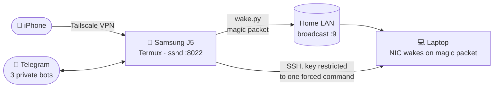
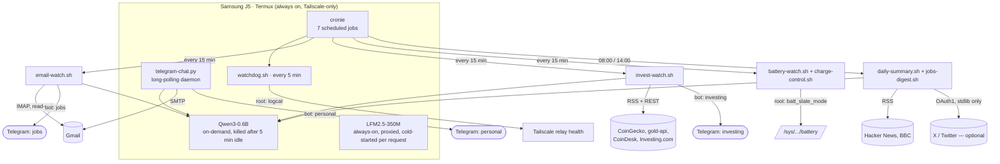

<div align="center">

# AXP.OS Bridge

### A de-Googled Android phone as a permanent Wake-on-LAN bridge, local-LLM assistant, and inbox/market watchdog

Old Samsung Galaxy J5 → custom de-Googled ROM → rooted, stripped down to 4 apps → wakes and shuts down a laptop over Tailscale, reads/replies/drafts email in natural language, watches RSS/markets/job boards, and reports everything through 3 private Telegram bots — running entirely on-device, with a local 0.6B LLM doing the language work.

🌍 **Language:** English · [Español](README.es.md)


[](LICENSE)

</div>

---

## Why this exists

A laptop that's off saves power but can't be reached remotely. Wake-on-LAN solves that — except the magic packet has to originate from *inside* the home network, so you still need something at home, powered on 24/7, to send it on request. Buying a smart plug or a Raspberry Pi is the normal answer. This project's answer was: an old Android phone already sitting in a drawer, running a de-Googled ROM so nothing phones home, permanently plugged in and connected over [Tailscale](https://tailscale.com/).

Once a phone is sitting there 24/7 anyway, it turns out to be a decent low-power Linux box: it can run a local LLM, watch an inbox, poll RSS feeds, and talk back over Telegram — all without an internet-exposed port, a cloud bill, or a single API key that isn't self-hosted.

## What it does

| Feature | How |
|---|---|
| 🖥️ **Wake a laptop from anywhere** | iPhone → Tailscale → SSH into the J5 → Wake-on-LAN magic packet on the home LAN |
| ⏻ **Shut it down from anywhere** | Telegram message → two-step confirmation → SSH with a key restricted to *one* forced command (`sudo poweroff`), nothing else |
| 🤖 **Local LLM, on-device** | `llama.cpp` compiled from source in Termux, two models: an always-fast one and an on-demand one for anything needing actual reasoning |
| 📬 **Reads, classifies, drafts and sends email** | IMAP watcher classifies incoming mail (important / routine / job lead), drafts replies and new emails — in natural language or a fixed format — always behind a review-and-confirm step before SMTP actually sends anything |
| 💬 **Three private Telegram bots** | Personal (tech/AI news, important email, device Q&A), Investing (BTC/gold moves, macro news), Jobs (filtered job leads, translated) |
| 📈 **Market + news watcher** | BTC/gold anomaly detection, keyword-triggered urgent alerts, batched digests instead of one message per headline |
| 🔋 **Battery-health-aware charging** | Physically cuts charging current at a threshold picked from actual calendar-aging research, not folklore — see [Battery strategy](#-battery-strategy-researched-not-guessed) |
| 🩺 **Self-healing watchdog** | Every 5 minutes: is `sshd` up, is Tailscale's tunnel up, is WiFi actually associated (not just the VPN), is the chat bot alive, is anything about to be OOM-killed |
| 🔐 **Root, used narrowly** | Two independent Magisk grants (an ephemeral USB-debug identity, and Termux itself), each used for exactly the one thing it's needed for — never as a blanket "run as root" escape hatch |

## Architecture





## Part 1 — Flashing the phone (start from zero)

This is the part most guides skip. Concretely, for a Samsung Galaxy J5 (2017), **SM-J530F**, codename `j5y17ltexx`:

1. **Pick a de-Googled ROM.** This project uses **[AXP.OS](https://axpos.org/)** (a [DivestOS](https://divestos.org/)/LineageOS-derived build) which ships [microG](https://microg.org/) instead of real Google Play Services — `com.google.android.gms`/`gsf` on this device are microG's compatibility stubs, not Google's actual binaries. Device page and downloads for this exact model: **[axpos.org/devices/samsung/j5y17lte](https://axpos.org/devices/samsung/j5y17lte/)** (ROM zip + recovery at [download.axpos.org/axp/j5y17lte/](https://download.axpos.org/axp/j5y17lte/), signing pubkey [on GitHub](https://github.com/sfX-android/update_verifier/raw/refs/heads/main/AXP.OS/j5y17lte_AXP.OS_pubkey), plus a Tor/`.onion` mirror listed on the same page for when the clearnet host is down).

   > [!WARNING]
   > **AXP.OS ships no firmware of its own** — it explicitly documents this as a manual step and points to third-party Samsung firmware mirrors (**sfirmware.com**, **samfrew.com**, see [axpos.org's firmware guide](https://axpos.org/docs/guides/firmware/samsung/)), which that same guide labels *"unverified and untested"*. **This is where a download failed during this project's own setup** — one of these third-party firmware mirrors would not complete. If you hit the same thing: check [archive.org](https://archive.org/) for the specific firmware filename your device needs (for this device, `HEIMDALL_SM-J530F_<CSC/build>_firmware.gz`-style names are typical) before giving up on a mirror — <!-- TODO(user): paste the exact archive.org URL that worked, so future readers don't have to repeat this search --> a working Internet Archive link goes here once confirmed.
2. **Flash it.** AXP.OS's own install guide explicitly recommends **[Heimdall](https://gitlab.com/BenjaminDobell/Heimdall)** (`heimdall flash --RECOVERY recovery.img`, see [axpos.org's non-A/B install guide](https://axpos.org/Installation-on-Non-A-B-devices)) over TWRP for this family of devices, and warns that Samsung's Anti-Rollback Protection can brick a device flashed incorrectly — read that guide fully before starting, don't improvise the command.
3. **Root with [Magisk](https://github.com/topjohnwu/Magisk)** (this project uses 30.7) by patching the boot image and flashing the patched image instead of the stock one. Root is *installed* at this stage but not granted to anything yet — every app that wants `su` still has to ask, per-app, later (see [Root, used narrowly](#-root-used-narrowly-not-as-an-escape-hatch)).

## Part 2 — Stripping it down to 4 apps

Everything not load-bearing gets disabled with `pm disable-user --user 0 <package>` (reversible with `pm enable`) — telephony/SMS UI (no SIM in this device), Bluetooth/NFC, the camera/gallery/calendar/calculator apps, backup infrastructure, the Aurora Store, microG/GSF's own settings UI, the duplicate stock launcher, and the setup wizard. **46 packages** disabled in total on this build.

**Kept, deliberately:**

| App | Package | Why |
|---|---|---|
| [Termux](https://github.com/termux/termux-app) | `com.termux` | The actual runtime — cron, Python, `llama.cpp`, sshd |
| [Termux:Boot](https://github.com/termux/termux-boot) | `com.termux.boot` | Starts everything after a reboot without manual intervention |
| [Termux:API](https://github.com/termux/termux-api) | `com.termux.api` | Battery status, WiFi info, job scheduler — the sysfs/dumpsys paths a normal app can't reach |
| [Tailscale](https://tailscale.com/) | `com.tailscale.ipn` | The only network path in or out; configured as Always-on VPN, no lockdown |
| [F-Droid](https://f-droid.org/) | `org.fdroid.fdroid` | The one remaining app store |
| [Olauncher](https://github.com/tanujnotes/Olauncher) | `app.olauncher` | Minimal text launcher — no icons, no widgets, nothing to render |

**Never touched** (core OS / boot risk): `android`, SystemUI, Settings, the settings/downloads/media content providers, the networkstack, `com.android.phone` (kept despite no SIM — too integrated to risk), the system WebView provider, `lineageos.platform`, and ~40 theme/RRO overlays with no process of their own.

**One real trap, if you ever touch wallpaper settings:** `com.android.wallpaper`/`com.android.wallpapercropper` are disabled by default on this build. With them off, any "set wallpaper" intent resolves to the wrong app entirely (it opened Contacts once). Re-enable them first.

### Termux from GitHub, not F-Droid

F-Droid signs every package with its own key, and the shared-UID relationship between Termux and Termux:Boot needs matching signatures. All three F-Droid builds of Termux:Boot tried here failed with `INSTALL_FAILED_SHARED_USER_INCOMPATIBLE` against an F-Droid Termux — there's no combination that works anymore. The fix is to use the [official GitHub releases](https://github.com/termux/termux-app/releases) for **both** Termux and Termux:Boot (and later Termux:API), never mixed with F-Droid builds. Re-flashing Termux changes its Android UID, which matters if anything (an SSH config, a script) hardcodes the old one.

## Part 3 — Making it survive a reboot

Getting `sshd` to come back after a real `reboot` (not a hot-restart) needed three non-obvious things, none of which are documented together anywhere:

1. **Termux:Boot has to be opened once, manually**, before it ever receives `BOOT_COMPLETED` — Android doesn't deliver that broadcast to an app that's never been launched.
2. **Battery-optimization exemption** for both Termux and Termux:Boot (`dumpsys deviceidle whitelist`).
3. **No screen lock / PIN.** With one set, Android's file-based encryption doesn't unlock until someone types the PIN by hand after boot — and `BOOT_COMPLETED` never reaches Termux:Boot (it isn't direct-boot-aware) until that happens. No PIN, and everything starts unattended.

Tailscale needs an explicit **Always-on VPN** flag too — a VPN app doesn't restart itself after reboot just because it isn't "force-stopped":

```sh
settings put secure always_on_vpn_app com.tailscale.ipn
settings put secure always_on_vpn_lockdown 0
```

All of this was verified against *real* reboots (`adb reboot` + poll `sys.boot_completed`), not hot restarts — sshd listening, WiFi and Tailscale up, all without touching the phone.

## Part 4 — The Wake-on-LAN bridge itself

```
iPhone → Tailscale → ssh -p 8022 into the J5 → ~/wake.py → UDP broadcast → :9 → laptop NIC wakes
```

[`wake.py`](scripts/wake.py) is eleven lines of stdlib `socket` — no dependency earns its keep for a magic packet. The laptop's NIC needs Wake-on-LAN enabled in firmware/OS for this to do anything.

**Talking to it from Telegram instead of SSH:** [`telegram-chat.py`](scripts/telegram-chat.py) recognizes a small fixed set of trigger phrases (`/wake`, `despertar`, `enciende el pc`, regex-matched, including irregular Spanish conjugations) *before* anything reaches the LLM — the model never decides whether to fire a magic packet, only a literal string match does. Shutdown is the same idea with one more layer, described next.

## Part 5 — Shutting the laptop down (this one has real teeth)

Waking a machine is harmless — worst case it turns on when nobody needed it to. Powering one off remotely is not: it can kill unsaved work. Three layers, each independently load-bearing:

1. **A dedicated SSH keypair**, generated on the phone, private key never leaving it. The corresponding line in the laptop's `authorized_keys` carries `command="sudo /usr/sbin/poweroff",no-pty,no-agent-forwarding,no-X11-forwarding,no-port-forwarding` — that key can run *exactly one command*, no shell, regardless of what the client asks for. A stolen key gets you a laptop that turns off, not a shell.
2. **A scoped sudoers rule** (`/etc/sudoers.d/`): `NOPASSWD` for that one exact binary path, not `sudo` in general.
3. **Two-step confirmation in chat**: the trigger phrase (`apaga el pc`, `/apagar`, imperative *and* subjunctive Spanish conjugations) only queues a request; the laptop only powers off if the literal word `CONFIRMAR` arrives within 60 seconds.

The forced-command approach was validated end to end with a harmless placeholder (`command="/usr/bin/true"`) *before* it was ever pointed at a real `poweroff` — the live SSH auth, the confirmation flow, and the fallback path all got exercised without any risk of actually cutting power mid-test.

## Part 6 — Local LLM, two ways

`llama.cpp` had to be compiled from source in Termux (~40 minutes on this CPU) — the official installer only ships prebuilt binaries for desktop platforms, not Android/Termux.

| Model | Port | Runs | Why |
|---|---|---|---|
| **LFM2.5-350M** | 8080 (public) | On-demand, proxied — a lightweight stdlib `http.server` listens 24/7 and only cold-starts `llama-server` on the first real request, killing it after 5 minutes idle | Fast (10 tok/s), used for occasional direct API access from outside the house — but it can't follow compound instructions or translate reliably, so nothing automated calls it |
| **Qwen3-0.6B** | 8082 (internal) | On-demand, started/stopped per call from `lib.sh` | What every automated script actually uses — needs the literal `/no_think` suffix or it burns its whole token budget "thinking" instead of answering (Qwen3's reasoning mode is on by default) |

Benchmarked head to head on this hardware (Cortex-A53, ~1.8GB usable RAM): LFM2.5 is roughly 2× faster and uses half the RAM, but Qwen3 actually follows instructions — hence the split.

The always-on proxy exists because the naive version (`llama-server` running 24/7) burned CPU/heat all day for a model nothing automated was calling — the phone is plugged in, so the cost wasn't battery, it was thermal.

## Part 7 — Reading, drafting, and replying to email in natural language

[`imap_watch.py`](scripts/imap_watch.py) polls Gmail read-only (`BODY.PEEK`, nothing marked as read), classifies each new message, and routes it. None of the classification is a single LLM call doing everything — a 0.6B model is not reliable enough for that, confirmed by testing:

- **LinkedIn / Monster job alerts**: parsed as structured text/HTML (`html.parser`, stdlib), filtered by keyword + seniority + location, batched into a digest instead of pinged one at a time.
- **"Your application was received" confirmations**: matched and dropped by a deterministic keyword filter *before* the LLM ever sees them — these aren't new leads and don't need action.
- **Recruiter/HR emails outside LinkedIn/Monster**: also a keyword filter (`recruit|candidate experience|talent acquisition|...`), because a 2-way IMPORTANT/ROUTINE prompt kept misfiring on these (the word "interview" alone made the model call everything urgent) — adding a 3-way classification made this *worse*, not better, so it went back to keywords deciding first, LLM only for what's left.
- **Everything else**: a genuine 2-way IMPORTANT/ROUTINE call to Qwen, only after the deterministic filters above have had a chance to intercept it.

**Composing and replying** go through the exact same safety pattern as shutdown — nothing sends without a human confirming:

- `/enviar` with a fixed `Para:`/`Asunto:`/body format — no LLM involved in *what* gets sent, ever.
- Natural language (`"manda un correo a x@y.com diciendo que…"`) — the recipient is extracted with a regex requiring a literal, present email address (never inferred by the model); only the *body* gets drafted by Qwen, from that fixed recipient.
- Replying to a message the bot already forwarded (native Telegram "Reply") — the original sender and `Message-ID` were captured when the alert was first sent, so a real reply gets `In-Reply-To`/`References` headers, not just a new unrelated email to the same address.
- Every path lands in the same draft: shown back verbatim, sent only on `CONFIRMAR` — **or**, resending the same `Para:`/`Asunto:`/body block *edited* sends the new version immediately, without a second confirmation round-trip. That specific behavior exists because the 0.6B model's drafts are usable but often need a line fixed before they're worth sending — see [Known limitations](#-known-limitations).

## Part 8 — Battery strategy (researched, not guessed)

The naive "keep it between 20–80%" rule is aimed at a phone that's unplugged and used all day — it optimizes for *cycle depth*. A phone that's permanently plugged in and mostly idle faces a completely different failure mode: **calendar aging** — degradation from sitting at a high state of charge over time, independent of cycling at all. [Battery University's BU-808](https://www.batteryuniversity.com/article/bu-808-how-to-prolong-lithium-based-batteries/) puts a rough number on it: after a year at 25°C, a cell stored at 40% keeps ~96% of its capacity; at 100%, ~80%.

That reframes the actual question: not "how wide should the range be," but "how low can the ceiling go." [`charge-control.sh`](scripts/charge-control.sh) physically cuts charging current at **60%** and resumes at **45%** — narrower and lower than the initial 75–80% this project started with — using the one sysfs node on this hardware (`batt_slate_mode`, Samsung's `sec_battery` driver) that actually stops charging for real (`charge_control_limit` is a no-op stub; `store_mode` gets permanently stuck and was ruled out entirely).

A second, separate round of research checked whether cycling *more often* at that narrower band does any harm — it doesn't. The "memory effect" that makes frequent partial charges feel risky is a NiCd/NiMH-era myth that doesn't apply to Li-ion; the depth-of-discharge/cycle-life relationship is strongly non-linear, so many *shallow* cycles are disproportionately gentler than the same total throughput in fewer *deep* ones. What actually damages a Li-ion cell is dwelling at the extremes — nearly empty or completely full — not how often it charges.

**A real safety incident from tuning this:** the first time charging was cut and resumed, resuming did not restore charging on its own — `status` stayed `DISCHARGING` with the charger connected, and only a full `reboot` fixed it. That's why the deployed version retries verified resumption up to 3 times and **reboots the device automatically** as a last resort (with a 1-hour cooldown so a persistent fault doesn't reboot-loop) rather than assuming the write succeeded. `battery-watch.sh` also repurposes its old "stuck at 100%" check into an anomaly detector: if the phone is ever seen near 100% at all, `charge-control.sh` has already failed silently, regardless of the exact threshold configured.

## Part 9 — Root, used narrowly (not as an escape hatch)

Two *separate* Magisk grants exist on this device, and they stayed separate on purpose:

- **The USB-debug ("shell") identity** — granted once, used for hands-on investigation over `adb shell su -c ...` (inventorying every `/sys/class/power_supply/battery/` node, testing which one actually stops charging, forcing Tailscale to reconnect via `am start-foreground-service` instead of opening its UI).
- **Termux's own identity (`u0_a120`)** — needed by things that run unattended from cron: `charge-control.sh` writing to `batt_slate_mode`, and `watchdog.sh` reading the Tailscale app's own `logcat` to catch a transient "relay unavailable" warning that has no other visible trace (no `tailscale` CLI ships on the Android build, no LocalAPI socket exposed).

Granting the second one wasn't as simple as tapping "Allow" — a cron job had already triggered Magisk's prompt once with nobody watching, and it silently denied by timeout. Magisk doesn't re-prompt once a decision is recorded; the fix was flipping Deny → Allow by hand in the Magisk app itself, not re-running the script and expecting a new dialog. Verified afterward: the very next watchdog tick went straight to the safe reconnect path with no denial and no UI flash.

What root did **not** become, once it was available: a way to hand the LLM broad `sudo`. Every root-gated action still runs through a fixed script path or a forced SSH command — never through a model deciding what command to run.

## 🩺 Known limitations

- **The 0.6B local model is genuinely limited.** Confirmed directly: asked about its own battery with no real data injected, it hallucinated about "a vehicle called Ride." Fixed by injecting real `termux-battery-status`/uptime/Tailscale-state data into every prompt that could plausibly need it — but drafted email/tweet text from this model still needs a human glance before confirming, every time.
- **Translation quality is rough.** Job-lead snippets get machine-translated to Spanish before forwarding; expect things like "Test Template" → "Preguntas de prueba" (should be "Plantilla de prueba"). Not worth chasing further at this model size.
- **`adb shell input text/keyevent` is genuinely dangerous near Tailscale's UI.** A stray `keyevent 66` (Enter) sent without capturing the screen first landed on Tailscale's connect toggle and disabled the VPN — more than once, during debugging sessions, almost always at a `:00/:05` cron-tick boundary once the *cause* was traced. Rule adopted afterward: never chain `input` calls without a screenshot between them, and avoid driving the device via USB at round 5-minute marks.
- **`ip` isn't in Termux's `$PATH`** (only in `/system/bin`, which Termux doesn't include) — `ip addr show tun0` silently returns nothing useful. Read `/proc/net/dev` directly instead.
- **`termux-job-scheduler --network none` does not mean "no network."** It means *no network constraint at all* — a job with that filter fires almost immediately whenever anything is pending. A two-job design meant to ping-pong on connectivity state turned into an unconstrained loop, ~1000 iterations in under 2 minutes, before the source scripts got overwritten with a no-op to break the chain. `--network any` is a real, working constraint (waits for actual connectivity) for a genuine single-shot job — just make sure that job never reschedules itself.
- **Writing into `/data/data/com.termux/` from outside the app — even as root — fails.** SELinux's per-app MLS categories block it regardless of Unix permissions. The only path that works: push to `/sdcard/Download/`, foreground Termux, and run the copy from *inside* its own shell.

## Quick start

This isn't a one-command installer — it's a fully manual setup, documented so it's reproducible, not automated:

```sh
# 1. Get Termux + Termux:Boot + Termux:API from the official GitHub releases
#    (not F-Droid — see Part 2)

# 2. Inside Termux
pkg install python git openssh cronie jq termux-api
git clone <this-repo-url>
cd axp-os

# 3. Credentials — never commit these, they're already gitignored
echo "your-gmail-app-password" > ~/.imap_pass
cp scripts/lib.sh ~/scripts/lib.sh   # then fill in the placeholders inside

# 4. Wire up autostart (Termux:Boot runs anything under ~/.termux/boot/)
mkdir -p ~/.termux/boot
cp boot/* ~/.termux/boot/

# 5. Cron (crontab -e), see the schedule table below

# 6. Compile llama.cpp from source (~40 min on a phone-class CPU)
git clone https://github.com/ggml-org/llama.cpp && cd llama.cpp && cmake -B build && cmake --build build -j4
```

### Cron schedule

| Schedule | Script | Does |
|---|---|---|
| `*/5 * * * *` | `watchdog.sh` | sshd/Tailscale/WiFi/chat-bot liveness, OOM diagnostics, CPU cap reassertion |
| `*/15 * * * *` | `email-watch.sh` | Classify + route new email |
| `*/15 * * * *` | `invest-watch.sh` | BTC/gold price + news watch |
| `*/15 * * * *` | `battery-watch.sh` | Temperature + stuck-charging anomaly alerts |
| `*/15 * * * *` | `charge-control.sh` | Cut/resume charging at 60%/45% |
| `0 8,14 * * *` | `daily-summary.sh` | Tech/AI/geopolitics digest (+ optional Twitter thread) |
| `0 8,14 * * *` | `jobs-digest.sh` | Batched job-lead digest |

### Environment / credentials (fill in your own — never commit real values)

| File | Contents | Used by |
|---|---|---|
| `scripts/lib.sh` | `BOT_TOKEN_PERSONAL`, `BOT_TOKEN_INVEST`, `BOT_TOKEN_JOBS`, `CHAT_ID`, local LLM `API_KEY` | Every script (`send_telegram`, `explain`) |
| `~/.imap_pass` | Gmail App Password | `imap_watch.py`, SMTP sending in `telegram-chat.py` |
| `~/.twitter_creds` | X API key/secret + access token/secret (OAuth1, 4 lines) — optional | `twitter.py` |
| `scripts/telegram-chat.py` | `LAPTOP_IP` (Tailscale IP), `LAPTOP_USER`, `EMAIL_USER` | Wake/shutdown, SMTP |
| `scripts/wake.py` | Target NIC's MAC address, LAN broadcast IP | Magic packet |

## Project structure

```text
axp-os/
├── scripts/          # Everything that runs on the phone via cron or Telegram
│   ├── lib.sh                  # Shared: Telegram send + logging, local-LLM calls
│   ├── watchdog.sh              # 5-min liveness + OOM + CPU-cap loop
│   ├── charge-control.sh        # Battery cutoff state machine
│   ├── battery-watch.sh         # Temperature/anomaly alerts
│   ├── cpu-limit.sh              # scaling_max_freq cap (idempotent)
│   ├── imap_watch.py / email-watch.sh    # Email classification + routing
│   ├── invest-watch.sh          # Market/news watcher
│   ├── daily-summary.sh         # Tech/AI/geo digest (+ Twitter thread)
│   ├── jobs-digest.sh / parse_jobs.py / job_filters.py   # Job-lead pipeline
│   ├── telegram-chat.py         # The bidirectional bot: wake/shutdown/email/tweet
│   ├── twitter.py               # Hand-rolled OAuth1 signing, stdlib only
│   ├── llm-proxy.py             # Cold-start proxy for the always-on model
│   ├── wake.py                  # The actual magic packet
│   └── check_move.py / parse_feed.py     # Small shared helpers
├── boot/             # Dropped into ~/.termux/boot/ — one shell script per service
├── LICENSE
└── README.md / README.es.md
```

## Roadmap / not done yet

- **Twitter/X posting** — code complete (OAuth1 signing validated against X's own documented worked example), not yet deployed: needs a free-tier X developer app with Read+Write access.
- **LinkedIn posting** — parked. Posting to a personal profile via API now sits behind partner approval (Marketing Developer Platform), not self-service like X.
- **Real-presence detection** — reading the home router's ARP table (`ip neigh`, viable now that root is available) to tell whether a phone is actually on the home LAN, for presence-based automations. Not started.
- **Dead-man's switch for power/internet outages** — this device has no SIM, so it can't report its own outage; a `healthchecks.io` ping from cron would let an *external* service raise the alarm instead.

## Disclaimer

Built for personal use on hardware the author owns and controls. The shutdown/root/SSH mechanisms here are deliberately scoped as narrowly as they could be made — a forced single command, not a shell; a scoped `sudoers` rule, not blanket `sudo`; two-step confirmation before anything irreversible — but this is still a phone with root and a laptop with a passwordless, remotely-triggerable `poweroff`. Understand every layer in [Part 5](#part-5--shutting-the-laptop-down-this-one-has-real-teeth) before adapting this to your own machines.

## 🤝 Contributing

Open to issues and PRs, especially around the [Roadmap](#roadmap--not-done-yet) items.

## 📄 License

MIT — see [LICENSE](LICENSE).

---

<div align="center">

Built by **[@adro0303](https://github.com/adro0303)**

</div>
